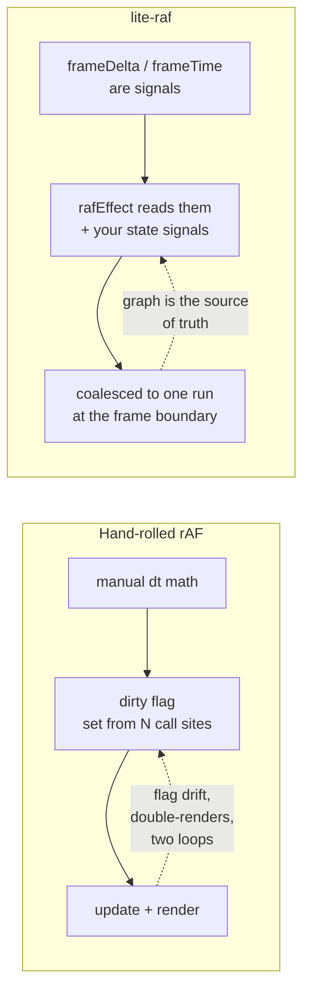
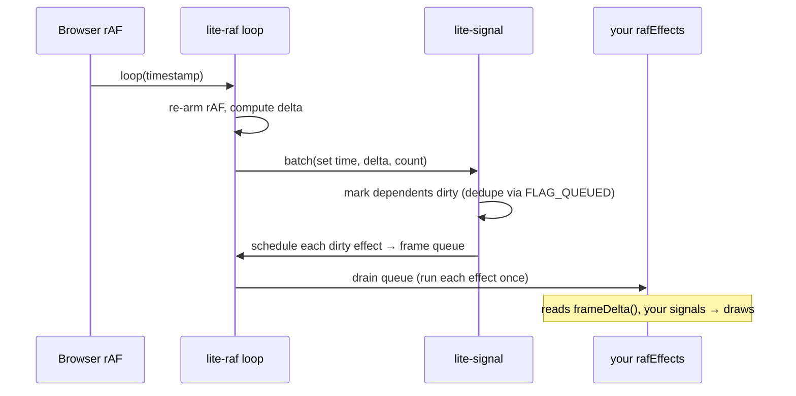
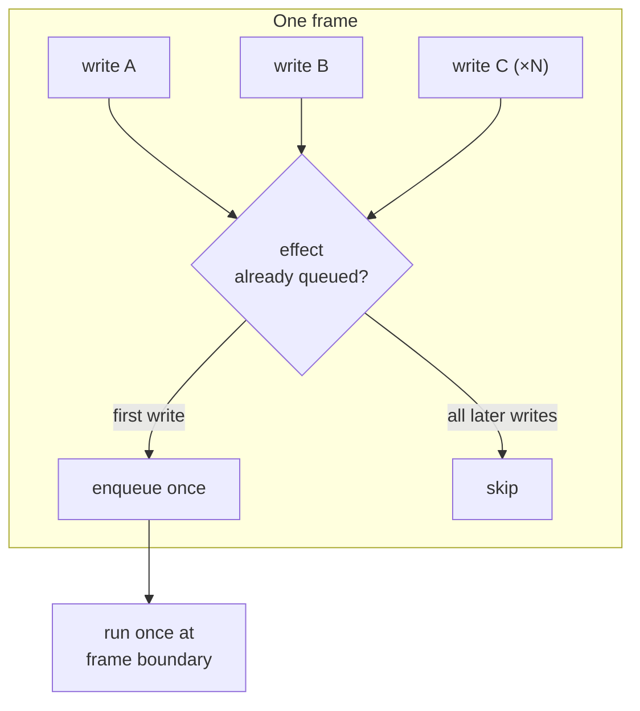
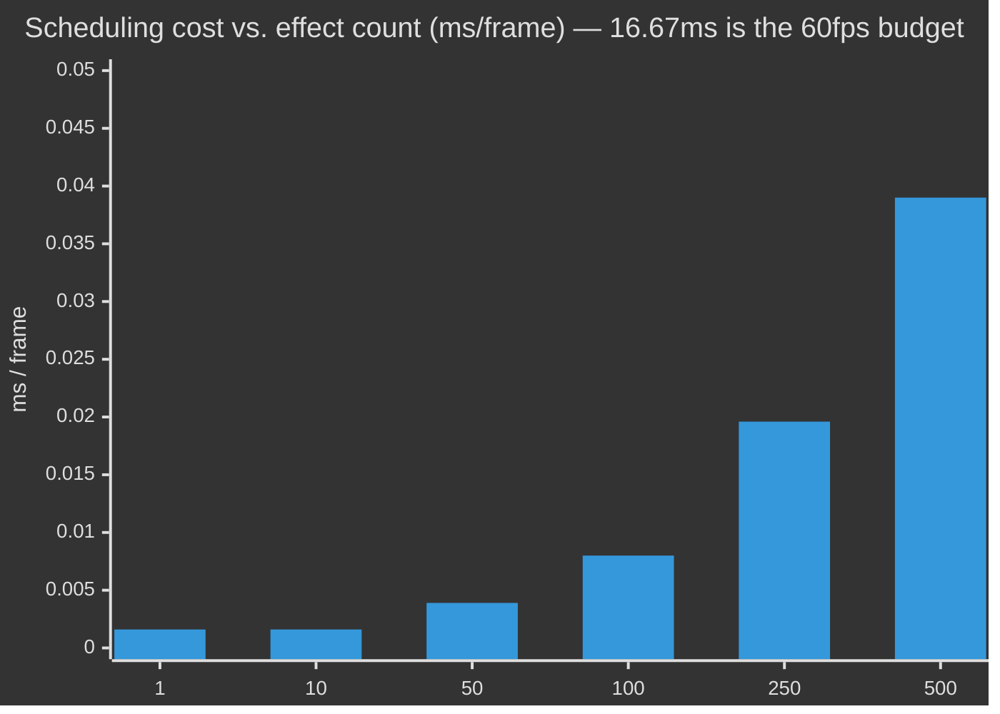

# @zakkster/lite-raf

[](https://www.npmjs.com/package/@zakkster/lite-raf)
[](https://bundlephobia.com/result?p=@zakkster/lite-raf)
[](https://www.npmjs.com/package/@zakkster/lite-raf)
[](https://www.npmjs.com/package/@zakkster/lite-raf)

[](https://github.com/PeshoVurtoleta/lite-signal)

[](https://opensource.org/licenses/MIT)

**Frame-rate scheduling for a fine-grained signals graph. One `requestAnimationFrame` loop, the frame clock exposed as reactive signals, and `rafEffect()` — effects that run at most once per frame and every frame, with zero retained allocations.**

Reactive libraries are built for *event* cadence: a value changes, dependents re-run immediately. Render loops are built for *frame* cadence: do the work once per frame, no matter how many things changed. `lite-raf` bridges the two. It turns the animation frame into a reactive primitive, so a render loop becomes a declarative dependency graph instead of a hand-rolled `requestAnimationFrame` callback.

```js
import { signal } from '@zakkster/lite-signal';
import { rafEffect, frameDelta, startFrames } from '@zakkster/lite-raf';

const x = signal(0);
const vx = 120; // px/sec

// Runs once per frame, integrating against the real frame delta.
rafEffect(() => {
  x.update(px => px + vx * (frameDelta() / 1000));
  ctx.clearRect(0, 0, canvas.width, canvas.height);
  ctx.fillRect(x.peek(), 100, 40, 40);
});

startFrames();
```

No `requestAnimationFrame` boilerplate. No manual `lastTime`/`delta` bookkeeping. No "did I already schedule a redraw this frame?" flag. The signal graph decides what re-runs; `lite-raf` decides *when*.

---

## Contents

- [Why](#why) · [What it is / is not](#what-it-is--is-not) · [Install](#install) · [Quick start](#quick-start)
- [How it works](#how-it-works)
- [The fixed-rate-display trap (and why this library avoids it)](#the-fixed-rate-display-trap)
- [API reference](#api-reference)
- [Benchmarks](#benchmarks)
- [Testing (for clients & QA)](#testing-for-clients--qa)
- [Running the demo](#running-the-demo)
- [Compatibility](#compatibility)
- [Edge cases & guarantees](#edge-cases--guarantees)
- [FAQ](#faq) · [License](#license)

---

## Why

Every canvas/WebGL project grows the same organ — a hand-rolled frame loop:

```js
// The loop you write first, in every project, slightly differently each time
let last = 0, rafId = 0, dirty = true;
function loop(now) {
  rafId = requestAnimationFrame(loop);
  const dt = last ? now - last : 0;
  last = now;
  if (!dirty) return;          // ad-hoc "only redraw if something changed"
  dirty = false;
  update(dt);
  render();
}
function markDirty() { dirty = true; }   // call this from 14 places, forget it in 3
requestAnimationFrame(loop);
```

It works, until it doesn't. The `dirty` flag drifts out of sync with the actual state. Two systems both want to redraw and you get double-renders. You add a second `requestAnimationFrame` somewhere and now there are two loops. The delta math gets copy-pasted with subtle differences.

If you already have a reactive graph (`@zakkster/lite-signal`), the dependency tracking that powers your UI can power your render loop too — *that's the whole idea*. You read a signal inside a `rafEffect`; when it changes, the effect is marked for re-run; at the frame boundary it runs **once**, regardless of how many of its inputs changed. The `dirty` flag becomes the signal graph, which can't drift because it's the same graph driving everything else.



---

## What it is / is not

- **It is** a ~90-line scheduler that plugs a `requestAnimationFrame` loop into lite-signal's effect system, plus three frame signals.
- **It is not** a renderer, a game engine, or a tween library. It schedules; it doesn't draw or interpolate. Pair it with your own canvas/WebGL code (and, e.g., `@zakkster/lite-ease` for easing).
- **It is not** a replacement for `requestAnimationFrame` when you have no signals. If you don't use lite-signal, you don't need this — a five-line loop is fine. The value appears the moment your *state* already lives in a reactive graph.

---

## Install

```bash
npm i @zakkster/lite-raf @zakkster/lite-signal
```

`@zakkster/lite-signal` is a **peer dependency**, and that is a correctness requirement, not a formality. lite-raf's frame signals live in lite-signal's *default registry*, which is module-level singleton state. If a second copy of lite-signal were installed nested under lite-raf, the frame clock would live in a different reactive graph than your app's signals and nothing would connect — silently. A peer dependency guarantees the single shared instance. Install both at the top level and you're set.

ESM-only. Ships TypeScript definitions. Requires `@zakkster/lite-signal` `^1.1.0` (the release that introduced the effect `scheduler` option).

```js
import { rafEffect, frameTime, frameDelta, frameCount, startFrames, stopFrames } from '@zakkster/lite-raf';
```

---

## Quick start

```js
import { signal, computed } from '@zakkster/lite-signal';
import { rafEffect, frameDelta, frameCount, startFrames, stopFrames } from '@zakkster/lite-raf';

const ctx = canvas.getContext('2d');

// Your state is plain signals.
const angle = signal(0);
const spinning = signal(true);

// A computed derived from a frame signal recomputes every frame, for free.
const fps = computed(() => 1000 / Math.max(frameDelta(), 0.001));

// One rafEffect = one job that runs once per frame.
const stop = rafEffect(() => {
  if (spinning()) angle.update(a => a + frameDelta() * 0.002);
  ctx.clearRect(0, 0, canvas.width, canvas.height);
  ctx.save();
  ctx.translate(canvas.width / 2, canvas.height / 2);
  ctx.rotate(angle.peek());
  ctx.fillRect(-50, -50, 100, 100);
  ctx.restore();
});

// A second, independent effect for the HUD.
rafEffect(() => {
  hud.textContent = `frame ${frameCount()} · ${fps().toFixed(0)} fps`;
});

startFrames();

// Pause logic without touching the loop — just flip a signal:
pauseButton.onclick = () => spinning.update(v => !v);

// Tear down completely:
// stop(); stopFrames();
```

---

## How it works

### One loop, three signals, one queue

`startFrames()` arms a single `requestAnimationFrame`. Each frame, the loop writes the new `(time, delta, count)` into the three frame signals **inside one `batch`**, so any effect that depends on them is marked dirty and enqueued exactly once. lite-signal's flush then hands each dirty `rafEffect` to lite-raf's scheduler, which parks it in a pre-allocated queue. The loop drains that queue at the end of the same frame.



### "At most once per frame" — the coalescing guarantee

Within a frame the three frame signals each change, and your own code may write to its state signals many times. lite-signal's dirty-marking sets a `QUEUED` flag the first time an effect is scheduled and clears it only when the effect actually runs — at the frame boundary. Every intervening write finds the flag already set and skips re-queuing. So an effect touched a thousand times between frames still runs **once**, with the final values.



### Zero-GC, honestly

The loop core allocates **nothing** per frame: the queue is one pre-grown array reused forever, the per-frame signal writes go through a single hoisted function (no closure captured per frame), and the loop re-arms with the same `loop` reference.

The one transient allocation in the `rafEffect` path is lite-signal's scheduler-dispatch closure — one short-lived closure **per active effect per frame**. It is nursery garbage, reclaimed by the very next scavenge, and it **never accumulates**. Measured retained heap growth over 200,000 frames with 100 active effects is effectively zero (see [benchmarks](#benchmarks)). For a render loop, "zero retained" is the number that matters: it's what lets an overlay run for an eight-hour stream without a slow climb into a GC death-spiral.

---

## The fixed-rate-display trap

This is the bug `lite-raf` was hardened against, and it's worth understanding because a naive frame-signal wiring gets it wrong.

A reactive signal normally **short-circuits an unchanged write**: `set(x)` where `x` equals the current value does nothing (no propagation), because re-running dependents would be wasted work. That's correct for application state. It is *catastrophic* for a frame delta.

On a display locked to a stable refresh rate with a steady compositor, consecutive `requestAnimationFrame` deltas can be **bit-identical** — `16.6666…` ms, frame after frame. If `frameDelta` short-circuited on equality, the effect reading it would stop firing the moment two deltas matched, and your animation would **freeze** — but only on some displays, for some users, while running perfectly on the developer's jittery laptop. The worst class of bug: environment-dependent and invisible in dev.

`lite-raf` creates the three frame signals with a forced-propagation equality (`equals: () => false`), so **every frame ticks every dependent**, regardless of whether the numeric value repeated. The per-frame contract holds on every display. This is covered by a dedicated test (`runs EVERY frame even when the delta is bit-identical`).

---

## API reference

### `rafEffect(fn): () => void`

Register a frame-scheduled effect. `fn` runs at the end of each frame in which a tracked dependency changed — at most once per frame, and every frame the loop ticks if it reads any frame signal. Returns an idempotent dispose function.

| Behaviour | Detail |
|---|---|
| Cadence | At most once per frame; reading a frame signal makes it run every frame. |
| Lifecycle | Runs only while the loop is running. Created before `startFrames()`, it runs once on the first frame after start, with the latest values. |
| Disposal | The returned fn disposes it. A trampoline already queued for the current frame is safely neutralised — the body will not run after disposal. |
| Cascade latency | If a `rafEffect` writes a signal another `rafEffect` reads, the downstream effect runs on the **next** frame. |
| Errors | A throw is caught, logged via `console.error`, and isolated — sibling effects in the same frame still run. |

### Frame signals

Each is a read-only accessor: call it for a tracked read, `.peek()` for an untracked read, `.subscribe(fn)` for a value-now-and-on-change subscription returning an unsubscribe fn. They have no `.set` — only the loop drives them.

| Signal | Type | Meaning |
|---|---|---|
| `frameTime` | `() => number` | Current frame timestamp (ms, `DOMHighResTimeStamp`). Monotonic. |
| `frameDelta` | `() => number` | Ms since the previous frame. `0` on the first frame. Your `dt`. |
| `frameCount` | `() => number` | Frames since module load. 32-bit; wraps after ~414 days @ 60fps. |

### Loop control

| Function | Description |
|---|---|
| `startFrames()` | Start the loop. Idempotent. Resets the delta baseline (first frame's delta is `0`). |
| `stopFrames()` | Stop the loop and cancel the pending frame. Effects are retained and resume on the next `startFrames()`. |

### Registry note

lite-raf binds to lite-signal's **default registry**, whose node pool defaults to ~1024 reactive nodes. If your app needs more, or you run isolated graphs (e.g. one per Twitch viewer), configure lite-signal *before* creating rafEffects:

```js
import { createRegistry, setDefaultRegistry } from '@zakkster/lite-signal';
setDefaultRegistry(createRegistry({ maxNodes: 8192, onCapacityExceeded: 'grow' }));
```

---

## Benchmarks

Run them yourself — the ratios are what's stable, not the absolute numbers:

```bash
npm run bench        # node --expose-gc bench/bench.js
```

`--expose-gc` is required for the retained-memory column. The benchmark drives a deterministic frame clock (no real rAF) so frame counts and timing are exact, then forces a full GC before/after the memory window so the figure is *retained* growth, not transient nursery garbage.

Measured on the CI sandbox — Node 22, Linux x64. Numbers are written to `bench/bench-results.json`.

### Dispatch cost (added per frame, on top of your own work)

| Active effects | ms / frame | % of a 60 fps budget | dispatches / sec |
|---:|---:|---:|---:|
| 0 (loop only) | 0.0015 | 0.009 % | — |
| 1 | 0.0016 | 0.010 % | 6.2 × 10⁵ |
| 10 | 0.0016 | 0.010 % | 6.3 × 10⁶ |
| 50 | 0.0039 | 0.023 % | 1.3 × 10⁷ |
| 100 | 0.0080 | 0.048 % | 1.3 × 10⁷ |
| 250 | 0.0196 | 0.117 % | 1.3 × 10⁷ |
| 500 | 0.0390 | 0.234 % | 1.3 × 10⁷ |

A 60 fps frame is **16.67 ms**. Scheduling **500** reactive effects costs **0.04 ms** — about a quarter of one percent of the budget — leaving the entire frame for your actual drawing.



### Retained heap growth (the leak test)

| Active effects | Frames | Total retained | Bytes / frame |
|---:|---:|---:|---:|
| 10 | 200,000 | 5,000 B | 0.025 |
| 100 | 200,000 | 9,648 B | 0.048 |

Sub-tenth-of-a-byte per frame at 100 effects — i.e. **flat**. The handful of kilobytes is GC measurement noise, not accumulation. An overlay can run indefinitely.

---

## Testing (for clients & QA)

Three levels, depending on how deep you want to look.

### 1. Unit tests — "does it do what it says?"

```bash
npm test            # node --test test/*.test.js
npm run test:gc     # adds --expose-gc to enable the leak assertion
```

**14 deterministic tests**, no wall-clock flake (a manual frame clock drives everything). A clean run ends with `# pass 14 / # fail 0` and exit code 0 — CI-ready.

| Group | What's pinned down |
|---|---|
| Lifecycle | `startFrames` arms exactly one rAF; `stopFrames` cancels it; double-start is a no-op |
| Frame signals | `frameTime` tracks the timestamp; first delta is `0`; `frameCount` +1/frame |
| Core promise | runs **every** frame on a bit-identical delta; runs **at most once** per frame across many writes; 3 frame-signal writes ⇒ 1 run |
| Disposal | stops future runs; idempotent; a queued trampoline for a disposed effect is neutralised |
| Cascades | a write into another effect's dep lands one frame later, monotonically |
| Stopped state | effects created pre-start run once on the first started frame |
| Error isolation | a throwing effect doesn't abort its siblings |
| Memory | no retained heap growth across 60k frames × 50 effects (requires `--expose-gc`) |

### 2. Benchmark — "does it perform as claimed?"

```bash
npm run bench
```

Exit code is always 0; the failing signal is the numbers. On any 2021+ machine you should see scheduling cost stay **under ~0.5 % of the frame budget at 500 effects**, and retained growth **under ~1 byte/frame**.

### 3. Visual smoke test — "does it actually animate?"

```bash
open example/demo.html      # no build step, no server
```

A live, interactive demo (next section). The QA signal: motion is smooth, the frame counter advances by exactly one per displayed frame, pausing freezes motion without stopping the loop, and the "kill the loop" button stops everything cleanly with no console errors.

### `npm run` reference

| Command | Does |
|---|---|
| `npm test` | Run the 14-test suite |
| `npm run test:gc` | Same, with the memory assertion enabled |
| `npm run bench` | Benchmark, writes `bench/bench-results.json` |
| `npm run verify` | `test:gc` + `bench` — the full check |

---

## Running the demo

```
example/demo.html
```

No build step. Open it directly (`file://`) in any modern browser. It imports lite-signal and lite-raf as ESM and renders a self-contained canvas scene — see the [demo file](example/demo.html) for the interactive control panel (pause, add/remove effects live, kill-the-loop, and a live FPS/allocation readout).

---

## Compatibility

The library is plain ESM and uses only `requestAnimationFrame`, `cancelAnimationFrame`, and lite-signal.

| Target | Supported |
|---|---|
| Chrome / Edge / Firefox / Safari (modern) | ✅ |
| Node 18+ (with a rAF shim — see `test/harness.js`) | ✅ |
| Bun / Deno | ✅ |
| Web Workers | ✅ (use a rAF polyfill or a manual tick loop) |

In non-browser environments there's no native `requestAnimationFrame`; provide one (or a manual frame driver). `test/harness.js` is a 30-line example of a deterministic driver.

---

## Edge cases & guarantees

- **Every frame, exactly once.** Frame signals force-propagate, so a `rafEffect` reading one runs on every ticked frame — even on a fixed-rate display with identical deltas — and the `QUEUED`-flag dedupe guarantees it runs no more than once per frame.
- **No per-frame allocation in the loop core, and zero retained growth overall.** The only transient allocation is one nursery-collected dispatch closure per active effect per frame; nothing is retained.
- **Disposal during a frame is safe.** A trampoline already queued for the current frame is neutralised by lite-signal's generation guard if its effect was disposed before it ran. Disposing the same effect twice is a no-op.
- **Cascades cost one frame.** A `rafEffect` that writes a signal another `rafEffect` reads schedules the downstream effect for the next frame, not the current one. Chain N effects and the tail lags by N frames — design pipelines, not deep cascades, for same-frame results.
- **`stopFrames()` is a pause, not a teardown.** It cancels the pending rAF but keeps effects registered; `startFrames()` resumes them. To free effects, call their dispose functions.
- **The first delta is `0`.** Guard divisions (`Math.max(frameDelta(), ε)`), or skip integration on `frameCount() === firstCount`.
- **`frameCount` is a 32-bit ticker.** It wraps to negative after ~414 days of continuous 60 fps. Use it to detect change, not as a monotonic clock.

---

## FAQ

**How is this different from just calling `requestAnimationFrame` myself?**
It isn't, if you have no reactive state. The value is integration: your render loop becomes part of the same dependency graph as your UI/state, so "what needs redrawing" is never a separate, drift-prone flag. You also get dt/time/count as composable signals and automatic per-frame coalescing.

**Do other signal libraries have this?**
Frame scheduling is not a primitive in the mainstream signal libraries (Preact Signals, SolidJS, alien-signals) — they target DOM/event cadence and leave the render loop to you. Exposing the animation frame *as signals* with a zero-retained scheduler is the niche `lite-raf` fills.

**Why does an effect reading only `frameDelta` still run when the delta repeats?**
By design — see [the fixed-rate-display trap](#the-fixed-rate-display-trap). Frame signals force propagation so animation never freezes on a stable display.

**Can I have multiple loops or per-component clocks?**
There is one loop and one frame clock (module singletons). For independent clocks, this version isn't the tool; a `createFrameScheduler(registry)` factory is the natural extension if you need it.

**Is it truly zero-GC?**
The loop core is. The full `rafEffect` path allocates one transient, nursery-collected dispatch closure per active effect per frame — never retained. "Zero **retained** allocations" is the honest claim, and it's the one that matters for a long-running loop. See [benchmarks](#benchmarks).

**Does `stopFrames()` lose queued work?**
Callbacks already parked for an in-flight frame stay in the queue and drain on the next started frame. Effects for disposed targets neutralise themselves.

**What about `setInterval` / fixed-timestep physics?**
Out of scope. `lite-raf` schedules on the display's frame cadence. For a fixed-timestep accumulator, run it *inside* a `rafEffect` using `frameDelta()` as the accumulator input.

---

## License

MIT © Zahary Shinikchiev
